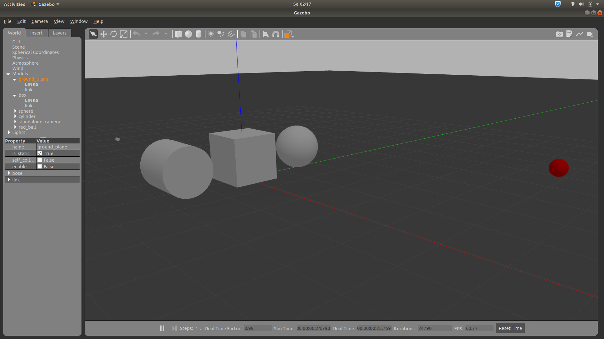
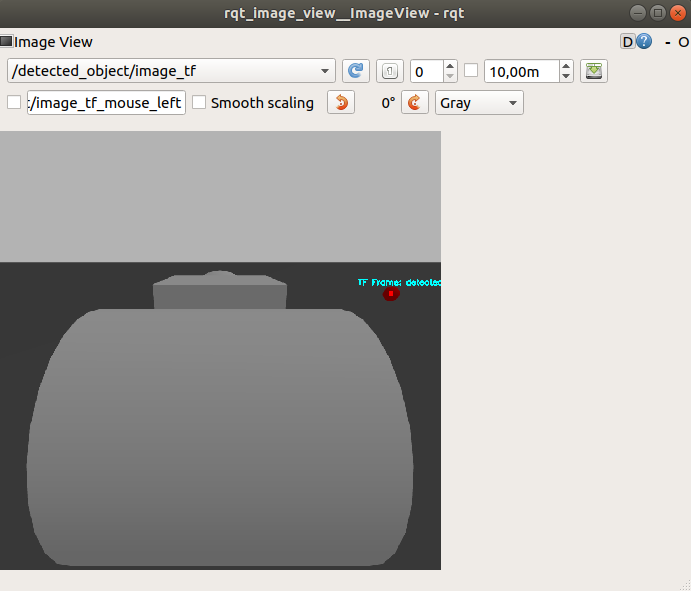
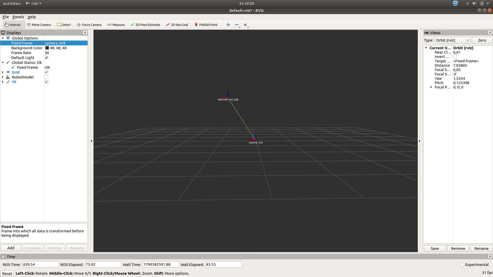

# gazebo-object-detection

## Tools Needed
1. Ubuntu 18.04
1. ROS Melodic (Robot Operating System)
2. Python
3. Gazebo
4. RVIZ

## Package Structure
```text
gazebo-object-detection/
├── launch/
│   └── camera_world.launch
├── models/
│   └── red_ball.sdf
├── src/
│   └── scripts/
│       ├── object_detector.py
│       ├── color_object_detector.py
│       ├── object_3d_position_estimator.py
│       └── object_tf_broadcaster.py
└── urdf/
    └── camera.urdf.xacro
```

## Implemented Features:
1. **Camera World Setup:** Custom camera model (`camera.urdf.xacro`) spawned inside Gazebo alongside standard geometric shapes and a target red sphere (`red_ball.sdf`).

2. **OpenCV Color Segmentation:** Segments red target objects using dual-range HSV thresholding and morphological filtering (`cv2.morphologyEx`)

3. **3D Spatial Projection:** Back-projects 2D centroid pixels $(u, v)$ to 3D camera coordinates $(X_c, Y_c, Z_c)$ using intrinsic parameters from `/camera/camera_info`.

4. **TF Frame Broadcasting:** Dynamically broadcasts `detected_red_ball` relative to `camera_link` for downstream robotics tasks.

## Execution Commands:
```bash

# For Camera World launch
roslaunch object_detection_gazebo camera_world.launch

# For running scripts
rosrun object_detection_gazebo <script_name_to_be_executed.py >

# Camera live feed
rosrun rqt_image_view rqt_image_view

# To visualize the frames in 3D space
rosrun rviz rviz
```

In RVIZ:
* Set Fixed Frame to world or camera_link
* Click Add $\rightarrow$ Select TF to see the `detected_red_ball` frame floating at its exact position!

## 3D Projection and Camera Intrinsics

### *Concept*
Now, since our robot has percepted the environment in the form of images which contains pixels localized using 2D coordinates $(u,v)$, we need to transform it to real world 3D coordinates $(X_c, Y_c, Z_c)$ relative to the camera and world frames. 

A 3D point in space is transformed to 2D image using the camera intrinsic matrix $K$. The matrix $K$ is composed of focal lengths $(f_x, f_y)$ and the optical centre $(c_x, c_y)$. The pinhole projection equation for 2D image generation is given by:

$$
\begin{bmatrix} 
    u    \\\\ v   \\\\     1 
\end{bmatrix} = \frac{1}{Z_c} 
\begin{bmatrix} f_x & 0 & c_x \\\\ 0 & f_y & c_y \\\\ 0 & 0 & 1 \end{bmatrix} \begin{bmatrix} X_c \\\\ Y_c \\\\ Z_c \end{bmatrix}
$$

Given the focal lengths $(f_x, f_y)$ and principal point offsets $(c_x, c_y)$ extracted from the `/camera/camera_info` topic, along with depth $Z_c$, we solve for the spatial 3D coordinates $(X_c, Y_c)$:

$$X_c = \frac{(u - c_x) \cdot Z_c}{f_x}$$

$$Y_c = \frac{(v - c_y) \cdot Z_c}{f_y}$$

### *ROS implementation*
Gazebo publishes the intrinsic parameters $(f_x, f_y, c_x, c_y)$ details on the topic `/camera/camera_info`. 

Since our camera current topic `/camera/rgb/image_raw` is an RGB stream, we can estimate depth from known geometry or switch to an RGB-D camera. 

## The TF library (TF2 here)
tf is a package that lets the user keep track of multiple coordinate frames over time. tf maintains the relationship between coordinate frames in a tree structure buffered in time, and lets the user transform points, vectors, etc between any two coordinate frames at any desired point in time. 

## Project Snapshots

**1. The Gazebo View**



<br>

**2. The RQT View**



<br>

**3. RVIZ View**

